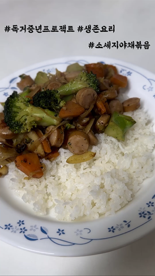

# 소세지야채볶음 #

## 재료 (2인분 기준) ##

* 양송이 4알
* 양파 1알
* 브로콜리 1/2개
* 당근 1개
* 마늘 6쪽
* 비엔나 소시지

## 순서 ##

1. 양파/양송이/브로콜리/당근 뭉텅뭉텅 썬다
1. 마늘 다진다. 다진마늘 써도 됨
1. 냄비에 마늘 다진 것 넣고 볶아서 마늘기름 낸다
1. 야채 넣고 볶아준다. 야채 빨리 볶고 싶으면 물 반 컵 정도 뿌리고 계속 볶는다
1. 소시지 넣고 볶아준다
1. 밥 위에 얹어 먹는다
1. 취향에 따라 타바스코 소스 혹은 토마토 소스 뿌려도 됨

## 결과 ##

