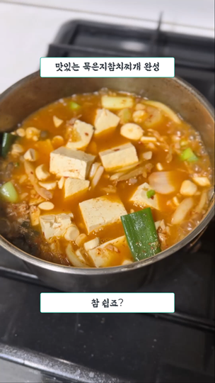

# 묵은지참치찌개 #

묵은지 국물이 잔뜩 남았을 때 김치 없이도 만들 수 있는 묵은지참치찌개

## 재료 (1인분 기준) ##

* 묵은지 국물
* 양파 1/2개
* 양송이 4알
* 대파 1/2개
* 마늘 4쪽
* 참치 1캔
* 두부 1모

## 순서 ##

1. 양파/양송이/대파 대충 썬다
1. 두부 깍둑썬다
1. 냄비에 묵은지 국물 + 마늘 다진 것 + 물 좀 더 넣고 끓인다
1. 끓으면 썰어둔 야채 넣고 계속 끓인다
1. 두부 넣고 계속 끓인다

## 결과 ##

