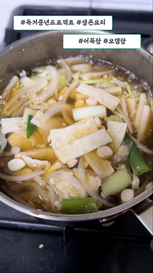

# 어묵탕 (오뎅탕) #

## 재료 (1인분 기준) ##

* 오뎅 2장
* 파 1/2대
* 양송이 4알
* 양파 반쪽
* 마늘 5쪽
* 무 1/4
* 진간장
* 국간장

## 순서 ##

1. 양파/양송이/대파 뭉텅뭉텅 썬다
1. 무는 좀 얇게 썬다
1. 오뎅 대충 썬다
1. 마늘 다진다. 다진마늘 써도 됨
1. 마늘 넣고 물 붓고 진간장 2큰술, 국간장 2큰술 넣고 끓인다
1. 물이 끓으면 양파/양송이/대파/무 넣고 야채육수 만든다
1. 얼추 시간 되면 오뎅 넣고 계속 끓인다
1. 물이 모자라면 조금 더 넣고 계속 끓인다
1. 마지막 간은 진간장 조금씩 넣어가며 맞춘다

## 결과 ##

